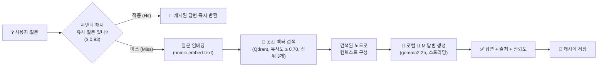
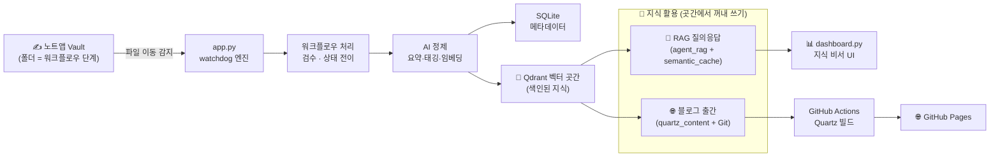
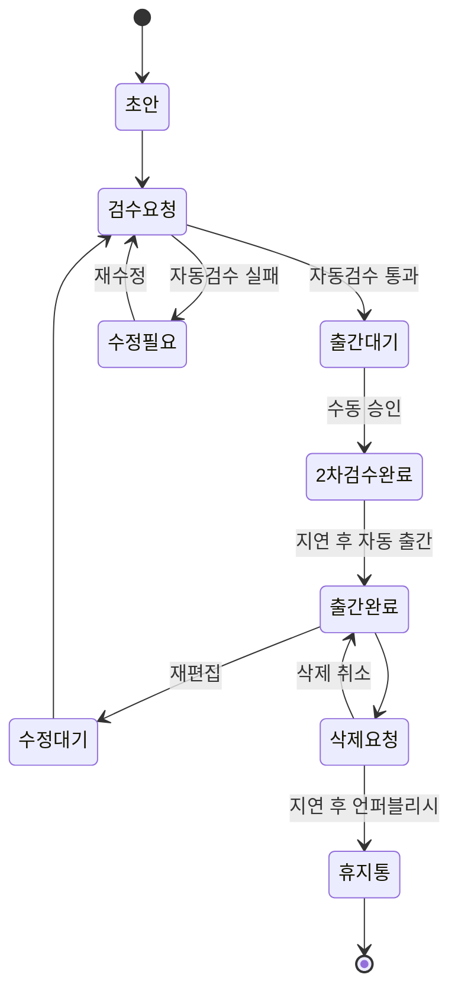

# 🌾 HarvestFlow — 지식 수확 파이프라인 프레임워크

> **쌓아둔 노트를 "언제든 꺼내 쓰는 지식"으로 수확합니다.**
>
> 노트를 폴더로 옮기는 것만으로 *검수 → AI 정제 → 벡터 색인*까지 자동으로 흐르는 **관리하기 쉬운 지식 파이프라인**입니다. 곳간에 쌓인 지식은 두 갈래로 꺼내 쓸 수 있습니다 — 🧠 **RAG 질의응답(지식 비서)** 과 🌐 **블로그 자동 출간**.

---

## 목차

1. [개발 목적 및 배경](#1-개발-목적-및-배경)
2. [내용 및 방법](#2-내용-및-방법)
3. [프로그램의 구조](#3-프로그램의-구조)
4. [실행 예](#4-실행-예)
5. [결론](#5-결론)

---

## 1. 개발 목적 및 배경

### 배경

개인 지식 관리 도구(Obsidian 등)에 노트는 계속 쌓이지만, 대부분은 **"쓰고 나면 다시 안 보는"** 죽은 저장소가 되기 쉽습니다. 문제의 본질은 *글쓰기*가 아니라, **쌓인 지식을 관리하고 다시 꺼내 쓰는 과정이 번거롭다**는 데 있습니다.

- 어떤 노트가 완성됐고, 검수됐고, 활용 가능한 상태인지 **관리가 안 됨**
- 필요한 지식을 **다시 찾아 꺼내 쓰기 어려움** (검색 ≠ 이해)
- 외부로 공개(블로그화)하려면 요약·검수·변환·배포 등 **수작업 반복**

### 목적 — 1순위는 "관리하기 쉬운 파이프라인"과 "지식 활용"

HarvestFlow의 최우선 목표는 **①관리하기 쉬운 지식 파이프라인**을 만들고, 그 위에서 **②쌓은 지식을 꺼내 쓰는 것**입니다. 블로그 출간은 그 자체가 목적이 아니라, **지식을 꺼내 쓰는 한 갈래**일 뿐입니다.

```text
[노트 작성] → [검수 · AI 정제 · 벡터 색인]  ←── 핵심: 관리하기 쉬운 파이프라인
                          │
                          ├── 🧠 RAG 질의응답  (내가 쓴 지식에게 물어보기)   ← 활용 ①
                          └── 🌐 블로그 출간    (지식을 외부에 공유하기)      ← 활용 ②
```

**핵심 목표 (우선순위 순)**

1. **관리하기 쉬운 파이프라인**: 파일을 폴더로 옮기는 것 = 상태 전이. 검수·정제·색인·배포의 진행 상황을 폴더 구조와 대시보드로 한눈에 관리
2. **지식 활용**: 곳간에 쌓인 지식을 두 갈래로 꺼내 쓰기
   - 🧠 **RAG 질의응답** — 쌓아둔 노트를 근거로 질문에 답하는 온디바이스 AI 지식 비서
   - 🌐 **블로그 출간** — 정제된 노트를 정적 사이트로 자동 배포
3. **로컬 우선(Local-first)**: 정제·임베딩·RAG를 모두 로컬 LLM(Ollama)으로 처리 → API 비용·프라이버시 걱정 없음
4. **도구 비종속 프레임워크**: 노트앱 · LLM · 메타DB · 벡터DB · 출간 채널을 **교체 가능한 구성요소**로 추상화

> **설계 관점**: HarvestFlow는 "블로그 자동화 앱"이 아니라, *"지식을 검수·정제·색인해 여러 형태로 꺼내 쓰는 범용 파이프라인 프레임워크"* 를 지향합니다. RAG와 블로깅은 곳간의 지식을 꺼내 쓰는 **소비자(consumer)** 이며, 현재의 스택(Obsidian/Ollama/Qdrant/SQLite/Quartz)은 **기본(default) 구현체**일 뿐입니다. 자세한 내용은 [3.5 확장성: 교체 가능한 구성요소](#35-확장성-교체-가능한-구성요소)를 참고하세요.

### 콘셉트: "지식 농사"

프로젝트 전반에 **농사(Farming) 메타포**가 적용되어 있습니다.

| 메타포 | 실제 의미 |
| --- | --- |
| 🌱 파종 (초안) | 노트 작성 |
| 🚜 검수 | 자동/수동 품질 검사 |
| 🌾 수확 (출간) | 웹 사이트 배포 |
| 📦 곳간 (Granary) | 벡터 DB 지식 저장소 |
| 🗑️ 휴지통 | 출간 철회/삭제 |

---

## 2. 내용 및 방법

### 2.1 핵심 아이디어 — "폴더가 곧 상태(State)"

Obsidian Vault 내부의 **폴더 이름이 곧 워크플로우 단계**입니다. 사용자가 노트를 다른 폴더로 드래그하면, 파일 감시자(watchdog)가 이를 감지해 해당 단계에 맞는 처리를 수행합니다.

| 단계(폴더) | 의미 | 트리거되는 동작 |
| --- | --- | --- |
| `1_초안` | 작성 중 | (대기) |
| `2_검수요청` | 1차 검수 요청 | 체크리스트 삽입 + **자동 검수** → 통과 시 `3_출간대기`, 실패 시 `4_수정필요` |
| `4_수정필요` | 자동 검수 실패 | 사용자가 수정 후 다시 `2_검수요청`으로 |
| `3_출간대기` | 수동 검수 대기 | `manual_review_passed: true` 감지 시 → `5_2차검수완료` (출간 예약) |
| `5_2차검수완료` | 출간 예약됨 | 지연 시간(기본 10분) 후 **자동 출간** → `6_출간완료` |
| `6_출간완료` | 배포됨 | AI 요약·태깅 + 벡터 색인 + Git 배포 완료 |
| `7_수정대기` | 출간 후 재수정 | 다시 `2_검수요청`으로 재진입 |
| `8_삭제요청` | 삭제 예약 | 지연 시간(기본 60분) 후 **자동 언퍼블리시** → `9_휴지통` |
| `9_휴지통` | 삭제 완료 | 게시 철회 완료 |

> 기존 이름(`초안`, `검수요청` 등) 폴더도 하위호환으로 인식하지만, 탐색 편의성을 위해 번호형 폴더 사용을 권장합니다.

### 2.2 자동 검수(1차) 방법

`2_검수요청` 폴더 진입 시, 규칙 기반으로 문서 품질을 검사합니다.

- **필수 프론트매터** 확인: `status`
- **본문 최소 길이** 확인: 80자 이상
- **금지 패턴** 검사: `TODO`, `TBD`, `작성 예정`, `lorem ipsum`, `내용 추가`
- 통과/실패에 따라 자동으로 폴더 이동 + 검수 체크리스트 삽입

### 2.3 AI 정제 및 벡터 색인 (파이프라인 공통 단계)

지식을 꺼내 쓰기 위한 전제가 되는 공통 단계입니다. 노트가 통과할 때 로컬 Ollama LLM이 본문을 정제하고 **지식 곳간(벡터 DB)** 에 색인(비축)합니다.

- **요약·태깅** (`gemma2:2b`): 본문을 2줄 요약 + 핵심 키워드 태그 3개 생성
- **임베딩** (`nomic-embed-text`, 768차원): 본문을 벡터화하여 Qdrant에 색인 (`ai_summary_and_tags` 등 메타데이터 함께 저장)

이렇게 곳간에 비축된 지식은 아래 **두 갈래(2.4 · 2.5)** 로 꺼내 쓰입니다.

### 2.4 지식 활용 ① — RAG 질의응답 (지식 비서) 🧠

> "내가 예전에 정리해 둔 그거, 뭐였더라?" 를 **내 노트에게 직접 물어보는** 기능입니다.
> 일반 검색이 *문서 목록*을 주는 것과 달리, RAG는 **내 지식만을 근거로 정리된 답변**을 돌려줍니다.

**동작 흐름**



**핵심 특징**

- **근거 기반(Grounded) 답변**: 검색된 노트 내용에만 기반해 답변하며, 곳간에 근거가 없으면 지어내지 않고 *"창고에 관련 지식이 비축되어 있지 않습니다"* 라고 답합니다. (환각 억제)
- **관련도 필터링**: 코사인 유사도 `0.70` 이상인 문서만, 최대 `3`개까지 컨텍스트로 사용 (`MIN_RETRIEVAL_SCORE`)
- **스트리밍 응답**: 토큰 단위로 실시간 출력 (`iter_rag_answer`)
- **시맨틱 캐시**: 과거 질문과 의미 유사도가 `0.93` 이상이면 LLM을 다시 호출하지 않고 캐시된 답변을 즉시 반환 → 속도↑, 연산↓ (`llm_cache` 컬렉션)
- **신뢰도 지표 제공**: 답변이 근거 문서에 얼마나 부합하는지 나타내는 **답변-근거 유사도**(`compute_answer_similarity`)와 **문서 유사도**를 함께 표시해, 답변을 얼마나 믿을지 판단하도록 도움
- **출처(Source) 표시**: 답변 생성에 사용된 원본 노트 제목·발췌를 함께 제공

**사용처**: `dashboard.py` 의 🌾 **지식 곳간(RAG)** 메뉴에서 질문을 입력하면 위 흐름이 실행됩니다. (실행법은 [4.3](#43-대시보드-실행) 참고)

### 2.5 지식 활용 ② — 블로그 출간 🌐

색인된 지식을 정적 웹사이트로 자동 배포하여 외부에 공유합니다.

1. AI 정제된 문서를 `quartz_content/` 폴더에 기록
2. Git `add` / `commit` / `push` (설정에 따라)
3. GitHub Actions가 [Quartz](https://quartz.jzhao.xyz/)로 정적 사이트를 빌드
4. `gh-pages` 브랜치로 GitHub Pages 배포

### 2.6 기술 스택 (기본 구현체)

아래는 **현재의 기본 구현**이며, 각 항목은 [3.5](#35-확장성-교체-가능한-구성요소)에서 설명하듯 다른 도구로 교체 가능하도록 추상화되어 있습니다.

| 구분 | 추상 개념 | 현재 구현 (default) |
| --- | --- | --- |
| 언어/런타임 | — | Python ≥ 3.14 (uv 패키지 매니저) |
| 파일 감시 | Note Watcher | `watchdog` (PollingObserver) |
| 노트앱 | Note App | Obsidian Vault |
| LLM | 요약·태깅·RAG | Ollama (`gemma2:2b`) |
| 임베딩 | Embedding | Ollama (`nomic-embed-text`, 768d) |
| 벡터 DB | Vector DB | Qdrant (로컬 임베디드 모드) |
| 메타 DB | Metadata DB | SQLite |
| 출간 채널 | Publish Client | GitHub + Quartz + GitHub Pages |
| 대시보드 | — | Streamlit |

---

## 3. 프로그램의 구조

### 3.1 전체 아키텍처



> 파이프라인의 종착점은 **벡터 곳간(Qdrant)** 이며, 그 뒤의 **RAG**와 **블로그 출간**은 곳간에 쌓인 지식을 꺼내 쓰는 두 갈래입니다.

### 3.2 디렉터리 구조

```text
harvest_flow/
├── app.py                  # 🚜 메인 워크플로우 엔진 (파일 감시 + 파이프라인)
├── dashboard.py            # 📊 Streamlit 대시보드 (통계/로그/RAG/출하 목록)
├── pyproject.toml          # 프로젝트 의존성 정의
├── .env.example            # 환경 변수 템플릿
│
├── config/                 # ⚙️ 설정 계층
│   ├── base.py             #   경로·기본값·워크플로우 폴더 상수
│   ├── env.py              #   .env 로딩 및 타입 파싱 유틸
│   └── llm.py              #   Ollama 모델/속도 설정
│
├── src/                    # 🧩 핵심 로직
│   ├── workflow.py         #   워크플로우 단계 정의·전이·1차 자동 검수
│   ├── agent_pipeline.py   #   출간용 LLM 요약·태깅
│   ├── agent_rag.py        #   RAG 답변 생성(스트리밍)
│   ├── semantic_cache.py   #   질문 의미 기반 시맨틱 캐시
│   ├── database.py         #   SQLite 메타 + Qdrant 벡터 색인/검색
│   ├── parser.py           #   마크다운 프론트매터 파싱
│   ├── utils.py            #   해시/캐시/Git 배포 유틸
│   └── logger.py           #   로깅
│
├── scripts/                # 🛠️ 점검·커밋 보조 스크립트
├── quartz_content/         # 📦 출하(배포)될 콘텐츠
└── .github/workflows/
    └── deploy.yml          # 🌐 Quartz → GitHub Pages 배포 워크플로우
```

### 3.3 핵심 모듈 역할

- **`app.py`** — 시스템의 심장. `watchdog`으로 Vault를 감시하고, 파일 변경 이벤트마다 해당 단계의 핸들러(`handle_review_request`, `handle_publish_wait`, `handle_second_review_publish`, `handle_soft_delete` 등)를 호출합니다. 시작 시 상태 동기화(`run_startup_sync`)와 예약 작업(지연 출간/삭제)도 주기적으로 처리합니다.
- **`src/workflow.py`** — 9개 워크플로우 단계 상수, 폴더 ↔ 단계 매핑, 노트 이동, 체크리스트 삽입, 1차 자동 검수 규칙, `post_id` 생성을 담당합니다.
- **`src/database.py`** — 파이프라인의 데이터 계층. 메타데이터(SQLite)와 벡터 색인/검색(Qdrant), Ollama 임베딩, 코사인 유사도 계산을 제공합니다.
- **`config/`** — 모든 경로·모델·지연 시간·폴더명을 환경 변수로 주입 가능하게 추상화합니다. (도구 종속성 최소화)

### 3.4 상태 전이 흐름



### 3.5 확장성: 교체 가능한 구성요소

HarvestFlow의 핵심 설계 원칙은 **"특정 도구가 아니라 역할(Role)에 의존한다"** 는 것입니다. 모든 외부 도구는 개념 용어로 추상화되어 있고, **환경 변수 + 클라이언트 팩토리 함수** 를 통해 선택·교체할 수 있습니다.

```python
# config/base.py — 도구를 값으로 선택 (특정 도구에 하드코딩하지 않음)
METADATA_DB_CLIENT = get_env("APP_METADATA_DB_CLIENT", "sqlite")
VECTOR_DB_CLIENT   = get_env("APP_VECTOR_DB_CLIENT", "qdrant")
PUBLISH_CLIENT     = get_env("APP_PUBLISH_CLIENT", "github")
NOTES_APP_NAME     = get_env("NOTES_APP_NAME", "obsidian")
```

```python
# src/database.py — 선택 값에 따라 구현을 분기하는 팩토리
def get_vector_db_client():
    if VECTOR_DB_CLIENT == "qdrant":
        return get_qdrant_client()
    raise ValueError(f"지원하지 않는 APP_VECTOR_DB_CLIENT: {VECTOR_DB_CLIENT!r}")
```

이 구조 덕분에 새로운 도구를 붙일 때는 **분기 하나(그리고 대응 함수)만 추가**하면 되고, 파이프라인 로직(`app.py`, `workflow.py`)은 전혀 건드릴 필요가 없습니다.

| 구성요소 | 추상화 지점 | 현재 구현 | 교체 방법 | 교체 가능 예시 |
| --- | --- | --- | --- | --- |
| **노트앱** | `NOTES_APP_NAME`, `NOTES_DIR` | Obsidian Vault | 감시할 폴더 경로 지정 | Logseq, 일반 파일 시스템, iCloud 폴더 |
| **LLM (요약/RAG)** | `config/llm.py`, `agent_*.py` | Ollama `gemma2:2b` | 생성 URL/모델명 변경 | 다른 Ollama 모델, OpenAI, vLLM 등 |
| **임베딩** | `EMBED_MODEL`, `get_ollama_embedding()` | `nomic-embed-text` | 임베딩 함수 교체 | OpenAI Embeddings, BGE 등 |
| **벡터 DB** | `APP_VECTOR_DB_CLIENT` + 팩토리 | Qdrant | 클라이언트 분기 추가 | Chroma, pgvector, Weaviate |
| **메타 DB** | `APP_METADATA_DB_CLIENT` + 팩토리 | SQLite | 연결 분기 추가 | PostgreSQL, MySQL |
| **출간 채널** | `APP_PUBLISH_CLIENT`, `publish_content()` | GitHub + Quartz | publish/unpublish 분기 추가 | Notion, Ghost, S3, Netlify |

> 즉, HarvestFlow는 **"노트앱이든 LLM이든 벡터DB든 출간 채널이든 원하는 것을 골라 끼우는 지식 출간 프레임워크"** 이며, `Obsidian + Ollama + Qdrant + SQLite + Quartz` 조합은 그 위에서 동작하는 하나의 완성된 참조 구현(reference implementation)입니다.

---

## 4. 실행 예

### 4.1 사전 준비

**1) 의존성 설치** ([uv](https://docs.astral.sh/uv/) 기반)

```bash
uv sync
```

**2) Ollama 설치 및 모델 다운로드**

```bash
# https://ollama.com 에서 설치 후
ollama pull gemma2:2b
ollama pull nomic-embed-text
```

**3) 환경 변수 설정**

```bash
cp .env.example .env
# 필요 시 .env 편집 (모델명, 지연 시간, Git push 여부 등)
```

주요 환경 변수:

| 변수 | 기본값 | 설명 |
| --- | --- | --- |
| `OLLAMA_PIPELINE_MODEL` | `gemma2:2b` | 요약·태깅 모델 |
| `OLLAMA_RAG_MODEL` | `gemma2:2b` | RAG 답변 모델 |
| `APP_PUBLISH_DELAY_MINUTES` | `10` | 출간 예약 지연(분) |
| `APP_DELETE_DELAY_MINUTES` | `60` | 삭제 예약 지연(분) |
| `GIT_PUSH` | `1` | 실제 Git push 수행 여부 |

### 4.2 워크플로우 엔진 실행

```bash
uv run app.py
```

실행하면 다음과 같은 로그가 출력됩니다.

```text
INFO  workflow startup sync 시작: 3개 노트
INFO  워크플로우 엔진 가동 중... (/path/to/obsidian_vault)
```

이제 Obsidian(또는 파일 탐색기)에서 노트를 **`2_검수요청` 폴더로 이동**하면:

```text
INFO  1차 자동 검수 통과 → .../3_출간대기/내-노트.md
```

프론트매터에 `manual_review_passed: true`를 설정하면 → 예약 출간 → 지연 시간 후:

```text
INFO  파이프라인 가동: 내-노트.md (id=260724220145-4a2c)
INFO  파이프라인 LLM 요약 완료
INFO  엔드투엔드 완료 (publish=github · vector=qdrant): 내-노트.md
INFO  자동 출간 완료(post_id=20260724-my-note-4a2c) → .../출간완료/내-노트.md
```

### 4.3 대시보드 실행

```bash
uv run streamlit run dashboard.py
```

대시보드에서 제공하는 메뉴:

- 📋 **지식 생태계 통합 수확 정보** — 단계별 노트 수, 곳간 적재량 등 통계
- 🚜 **실시간 지식 농사 일지** — 인프라 로그 뷰어
- 🌱 **보관소 파종 대기** — Vault 노트 목록
- 🌾 **지식 곳간 (RAG)** — 온디바이스 AI 지식 비서(질의응답 + 시맨틱 캐시)
- 📦 **출하된 작물 목록** — 배포된 콘텐츠
- 🗃️ **메타데이터 삭제 이력**

**RAG로 곳간의 지식 꺼내 쓰기** (🌾 지식 곳간 메뉴)

색인된 노트가 있다면, 질문을 입력해 내 지식에게 직접 물어볼 수 있습니다.

1. 🌾 **지식 곳간(RAG)** 메뉴로 이동
2. 예: `"Redis 소켓 타임아웃 어떻게 해결했지?"` 입력
3. 시스템이 곳간에서 관련 노트를 찾아, 그 내용을 근거로 답변을 스트리밍합니다.

```text
INFO  RAG 스트리밍 시작 (model=gemma2:2b, 질의: Redis 소켓 타임아웃 어떻게 해결했지?)
INFO  RAG 스트리밍 완료
```

- 같은 질문을 다시 하면 시맨틱 캐시가 적중해 즉시 답합니다.

```text
INFO  시맨틱 캐시 적중 (96.4%) past='Redis 타임아웃 해결법' current='Redis 소켓 타임아웃 어떻게 해결했지?'
```

- 곳간에 근거가 없는 질문에는 지어내지 않고 *"창고에 관련 지식이 비축되어 있지 않습니다"* 라고 답합니다.
- 답변과 함께 **출처 노트**와 **신뢰도 지표**(문서 유사도 · 답변-근거 유사도)가 표시됩니다.

### 4.4 출간된 노트의 결과 예시

`quartz_content/`에 기록되는 출간 문서 형식:

```markdown
---
title: 내 노트
status: 출간
post_id: 20260724-my-note-4a2c
---

### 🤖 AI 자동 요약 및 인덱싱
요약:
- 핵심 요약 첫 번째 줄
- 핵심 요약 두 번째 줄
태그:
#데이터 #자동화 #생산성

---

### 본문
(원본 노트 내용...)
```

### 4.5 출간된 노트 수정하기

이미 출간된(`6_출간완료`) 노트를 고치고 싶을 때는, **노트를 `7_수정대기` 폴더로 이동**하면 됩니다. 그러면 시스템이 자동으로 다시 검수 흐름에 태웁니다.

**따라 하기**

1. `6_출간완료/내-노트.md` 를 **`7_수정대기` 폴더로 이동**
2. 엔진이 이를 감지해 자동으로 `2_검수요청` 단계로 되돌립니다.

```text
INFO  수정대기 진입 감지 → 검수요청 재진입: .../2_검수요청/내-노트.md
INFO  1차 자동 검수 통과 → .../3_출간대기/내-노트.md
```

3. 노트 내용을 수정한 뒤, [4.2](#42-워크플로우-엔진-실행)의 출간 흐름과 동일하게 진행합니다.
   - `3_출간대기`에서 프론트매터에 `manual_review_passed: true` 설정 → `5_2차검수완료` → 지연 후 **재출간**
   - 재출간 시 `quartz_content/`의 기존 파일이 새 내용으로 덮어써지고 Git에 다시 커밋·배포됩니다.

> 💡 요약 흐름: `6_출간완료` → **`7_수정대기`** → `2_검수요청` → `3_출간대기` → `5_2차검수완료` → `6_출간완료`(갱신)

### 4.6 출간된 노트 삭제(게시 철회)하기

노트를 웹에서 내리고 싶을 때는 **노트를 `8_삭제요청` 폴더로 이동**합니다. 실수 방지를 위해 **바로 삭제되지 않고 지연 시간(기본 60분) 뒤** 자동으로 게시가 철회됩니다.

**따라 하기**

1. 대상 노트를 **`8_삭제요청` 폴더로 이동**
2. 엔진이 삭제를 예약합니다. (즉시 삭제 아님)

```text
INFO  삭제 요청 접수: 내-노트.md (due in 60 min)
```

3. 지연 시간이 지나면 자동으로 **게시 철회(`quartz_content`에서 `git rm` + 배포)** 후 `9_휴지통`으로 이동합니다.

```text
INFO  soft 삭제 완료 → 휴지통 이동: .../9_휴지통/내-노트.md
```

**삭제 취소하기**

지연 시간이 지나기 전이라면, 노트를 `8_삭제요청` **밖의 다른 폴더로 다시 이동**하면 예약된 삭제가 자동으로 취소됩니다.

```text
INFO  삭제 요청 취소: 내-노트.md (stage=출간완료)
```

**지연 시간 조정**

`.env`에서 삭제 대기 시간을 바꿀 수 있습니다. (테스트 시 짧게 설정 권장)

```bash
APP_DELETE_DELAY_MINUTES=1   # 1분 뒤 삭제
```

> ⚠️ 파일 자체를 Vault에서 **직접 삭제/이동으로 없애면**, 엔진은 이를 감지해 메타데이터·벡터 색인·캐시·출하 파일을 정리합니다(`cleanup_note_artifacts`). 다만 안전한 게시 철회 흐름을 원한다면 `8_삭제요청` 폴더를 사용하는 것을 권장합니다.

---

## 5. 결론

HarvestFlow는 **"노트를 폴더로 옮긴다"** 는 단순한 행위를 트리거로, 쌓아둔 지식을 **검수 → AI 정제 → 벡터 색인**하는 **관리하기 쉬운 파이프라인**을 만들고, 곳간에 비축한 지식을 자유롭게 **꺼내 쓰는** 로컬 우선 프레임워크입니다. RAG 질의응답과 블로그 출간은 이 파이프라인이 비축한 지식을 꺼내 쓰는 두 갈래일 뿐입니다.

### 기여점

- **관리하기 쉬운 파이프라인**: 폴더 이동만으로 상태를 전이하고, 검수·정제·색인의 진행 상황을 폴더와 대시보드로 한눈에 관리
- **지식 활용 (1순위 가치)**: 곳간에 비축한 지식을 🧠 RAG 질의응답과 🌐 블로그 출간 두 갈래로 꺼내 씀 — "쓰고 버리는 노트"가 아니라 "계속 꺼내 쓰는 지식"
- **비용·프라이버시 이점**: 요약·임베딩·RAG를 모두 로컬 LLM(Ollama)으로 처리해 외부 API 비용과 데이터 유출 위험이 없음
- **도구 비종속 프레임워크**: 노트앱 · LLM · 임베딩 · 메타DB · 벡터DB · 출간 채널을 모두 교체 가능한 구성요소로 추상화. 현재 스택은 참조 구현일 뿐

### 향후 확장 방향

- **활용처(consumer) 확대**: RAG·블로그 외에 뉴스레터, 슬랙 봇, 주간 회고 자동 생성 등 곳간의 지식을 꺼내 쓰는 새로운 갈래 추가
- 출간 채널(Publish Client) 다변화 (현재 GitHub/Quartz → Notion, Ghost 등)
- 메타/벡터 DB 백엔드 다변화 (SQLite/Qdrant → PostgreSQL, pgvector 등)
- LLM 기반 2차 자동 검수(사실 검증·문체 교정) 도입

> 쓰고 버려지는 노트는 없습니다. 쌓인 지식을 다시 꺼내 쓰세요. 🌾
